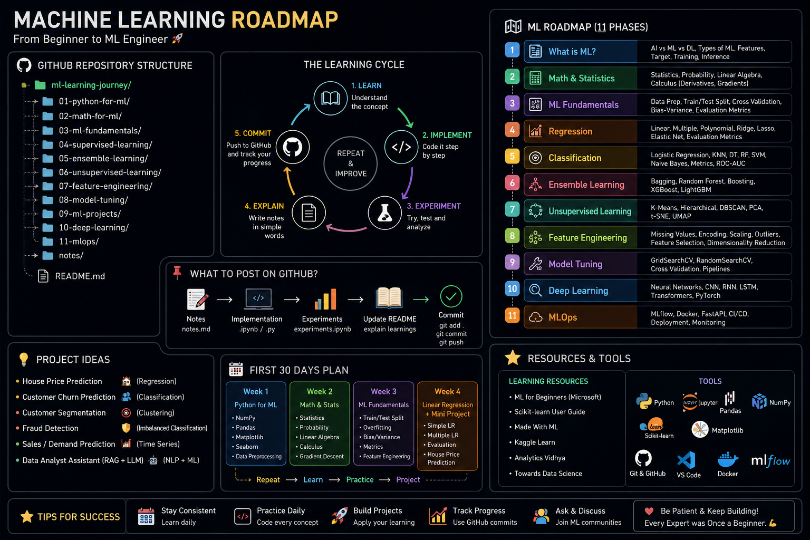

# Machine Learning Roadmap 🗺️

A curated, beginner-to-intermediate friendly collection of notes, guides, and hands-on notebooks covering the core concepts and algorithms of Machine Learning. This repository is meant to serve as a self-study roadmap — starting from the fundamentals of AI/ML/DL, moving through data preparation, and ending with practical implementations of popular algorithms on real datasets.



## 📖 Contents

### 📄 Concept Guides (PDFs)
| File | Description |
|------|-------------|
| `AI vs ML vs Deep Learning.pdf` | Breaks down the differences and relationships between Artificial Intelligence, Machine Learning, and Deep Learning. |
| `Introduction to Machine Learning.pdf` | A beginner-friendly introduction to what Machine Learning is, its types, and common use cases. |
| `EDA and Machine Learning Data Preparation.pdf` | Covers Exploratory Data Analysis (EDA) techniques and how to prepare data before feeding it into ML models. |
| `Linear_Regression_GitHub_Project.pdf` | Conceptual and practical guide to Linear Regression. |
| `Logistic Regression Practical Guide.pdf` | Practical walkthrough of Logistic Regression for classification tasks. |
| `K_Nearest_Neighbors_Guide.pdf` | Explains the K-Nearest Neighbors (KNN) algorithm with practical notes. |
| `Naive_Bayes_GitHub_Guide.pdf` | Covers the Naive Bayes classifier and its applications. |
| `SVM_Machine_Learning_GitHub_Guide.pdf` | Guide to Support Vector Machines (SVM) for classification problems. |

### 💻 Hands-on Notebooks
| Notebook | Dataset | Description |
|----------|---------|-------------|
| `ford_price_prediction.ipynb` | `ford.csv` | Predicts used Ford car prices using regression techniques. |
| `heart_d.ipynb` | `heart.csv` | Explores heart disease data and builds a classification model. |
| `insurance.ipynb` | `insurance.csv` | Predicts medical insurance charges based on customer attributes. |
| `titanic.ipynb` | (Titanic dataset) | Classic Titanic survival prediction problem, covering EDA and classification modeling. |

### 🗂️ Datasets
- `ford.csv` — Used car listing data for price prediction.
- `heart.csv` — Patient health data for heart disease classification.
- `insurance.csv` — Customer demographic and insurance cost data.

### 🖼️ Visual Roadmap
- `ml_roadmap.png` — A visual roadmap summarizing the learning path covered in this repository.

## 🎯 Learning Path

This repo is structured to be followed roughly in this order:

1. **Foundations** — Start with `AI vs ML vs Deep Learning.pdf` and `Introduction to Machine Learning.pdf` to build conceptual clarity.
2. **Data Handling** — Read `EDA and Machine Learning Data Preparation.pdf` to learn how to clean and explore data.
3. **Core Algorithms** — Work through the algorithm guides in order:
   - Linear Regression → Logistic Regression → KNN → Naive Bayes → SVM
4. **Practice** — Apply what you've learned using the notebooks (`titanic.ipynb`, `heart_d.ipynb`, `insurance.ipynb`, `ford_price_prediction.ipynb`) on real-world datasets.

## 🛠️ Tech Stack

- **Language:** Python
- **Environment:** Jupyter Notebook
- **Common Libraries:** pandas, numpy, matplotlib/seaborn, scikit-learn

## 🚀 Getting Started

1. Clone the repository:
```bash
   git clone https://github.com/anushka-tyagi01/Machine_Learning_Roadmap.git
   cd Machine_Learning_Roadmap
```
2. Install the required libraries:
```bash
   pip install pandas numpy matplotlib seaborn scikit-learn jupyter
```
3. Launch Jupyter Notebook and open any `.ipynb` file to start exploring:
```bash
   jupyter notebook
```

## 🤝 Contributing

Suggestions and improvements are welcome! Feel free to open an issue or submit a pull request if you'd like to add more guides, notebooks, or fix any existing content.

## 📌 Note

This repository is intended for educational purposes as a self-paced Machine Learning roadmap.
